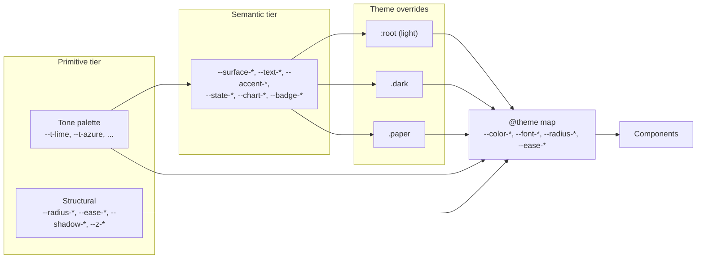

# Design Tokens & Rebrand Playbook 🎨

How theming works in this app, and how to reskin it without touching components.

All tokens live in [`src/app/globals.css`](../src/app/globals.css). There is no separate Tailwind config file — Tailwind v4 reads the `@theme` block directly.

## Token tiers

The system is layered so a rebrand changes _values_, never _component code_.

### 1. Primitive tier — raw identity

- **Tone palette** (`--t-lime`, `--t-azure`, `--t-violet`, `--t-rose`, `--t-warm`, `--t-neutral`). Shared across all themes. The brand's color DNA.
- **Structural** (`--radius-*`, `--ease-*`, `--duration-*`, `--shadow-*`, `--z-*`). Corner language, motion, elevation, stacking.

### 2. Semantic tier — meaning, not color

- `--surface-*` — backgrounds (primary/secondary/raised/border, plus `--paper-clue`).
- `--text-*` — primary/secondary/muted ink.
- `--accent-*` — lime accent ramp (primary/hover/active/soft/strong/deep/glow).
- `--state-*` — positive/negative/warning/info, mapped to tones.
- `--chart-*` — grid/axis/series, drawn from tones.
- `--badge-*` — per-tone bg/hover/text triples (WCAG AA).

Components reference **semantic** tokens only. Never a raw tone.

### 3. Theme overrides

`:root` (light, default), `.dark`, `.paper`. Each redefines semantic values; `.paper` only overrides surfaces and inherits the rest. The active theme class is set on `<html>` by the inline script in [`layout.tsx`](../src/app/layout.tsx) (reads `localStorage.theme`: `light` | `dark` | `paper` | unset = system).

### 4. Tailwind `@theme` map

Maps semantic CSS vars to Tailwind utilities:

- `--color-*` → `bg-*`, `text-*`, `border-*` (e.g. `bg-surface-primary`, `text-accent-primary`).
- `--font-*` → `font-heading`, `font-body`, `font-mono`.
- `--radius-*` → `rounded-*` (e.g. `rounded-lg`).
- `--ease-*` → `ease-*`, `--shadow-*` → `shadow-*`.

## Color space

All colors are [`oklch`](https://oklch.com). Lightness/chroma/hue are independent, so tone-mixing (`color-mix(in oklch, …)`) stays predictable across themes. Keep new colors in oklch.

## How to rebrand 🔧

A reskin should be a token edit, not a component sweep.

1. **Swap the tone palette** — change the six `--t-*` values in `:root`. Semantic tokens that map straight to tones (state, chart, badges) follow automatically.
2. **Retune semantic ramps** — adjust `--accent-*` and `--text-*`/`--surface-*` lightness for AA contrast on the new tones. Repeat for `.dark`.
3. **Change corner language** — edit `--radius-*` once; everything using `rounded-*` updates.
4. **Adjust motion / elevation** — edit `--ease-*`, `--duration-*`, `--shadow-*`. The app is flat today (`--shadow-flat`); a rebrand can lift surfaces by pointing `.elevation-*` utilities at richer shadows.
5. **Verify contrast** — run the Lighthouse accessibility audit (min 90, per project rules) and check every theme: light, dark, paper.

## Hard rules

- Components consume **semantic** tokens and Tailwind utilities — never raw tones or hardcoded hex/rgb.
- Every metric/color decision must survive all three themes. Test all three.
- New transitions use `--duration-*` + `--ease-*`, not inline magic numbers.
- Stacking uses `--z-*`, not ad-hoc `z-index` values.
